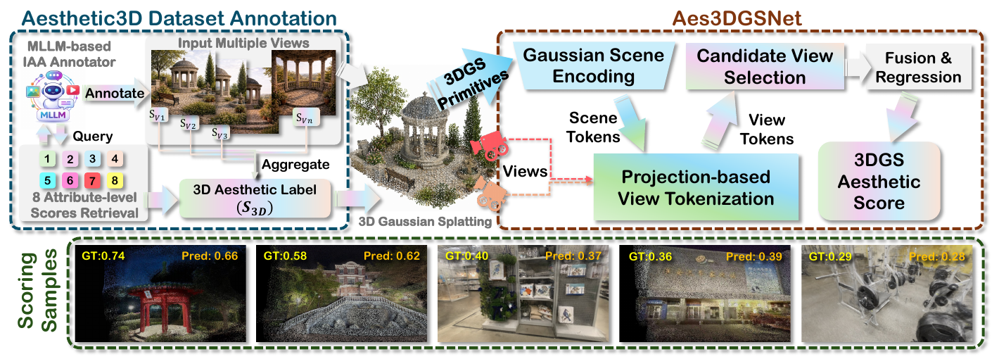
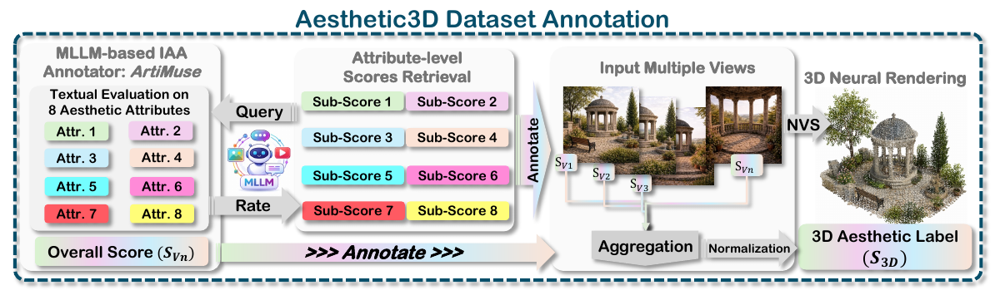
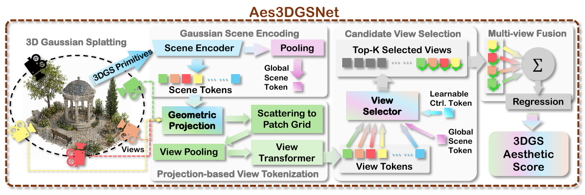

# Aes3D: Aesthetic Assessment in 3D Gaussian Splatting

Aes3D is a framework for assessing the aesthetics of 3D Gaussian Splatting scenes. It introduces **Aesthetic3D**, a dataset with scene-level aesthetic annotations, and **Aes3DGSNet**, a lightweight model that predicts aesthetic scores directly from 3D Gaussian primitives. This repository provides the model, training code, and annotations for 278 scenes.



**Aes3D overview.** Aesthetic3D provides scene-level aesthetic labels from multiple rendered views. Aes3DGSNet predicts aesthetic scores directly from 3D Gaussian primitives. The examples compare ground-truth (GT) and predicted (Pred) scores reported in the paper.

## Aesthetic3D annotation pipeline



[ArtiMuse](https://github.com/thunderbolt215/ArtiMuse) assigns overall and eight attribute-level aesthetic scores to rendered views. The view-level scores are aggregated and normalized into scene-level labels. This release includes 278 scene-level annotation rows.

## Aes3DGSNet architecture



Gaussian primitives are encoded into scene tokens and projected onto candidate-view patch grids. A learned top-K selector retains informative views, whose features are fused to predict the scene-level aesthetic score.

## Contents

This release provides the Aes3DGSNet model, training code, and aesthetic annotations for 278 scenes.

- `model.py`: Gaussian encoding, geometric projection, view selection, and score regression.
- `loss.py`: Huber regression and pairwise hinge ranking.
- `dataloader.py`: scene loading, camera sampling, and seed-controlled train/test splits.
- `train.py`: training and final-epoch evaluation.
- `data/aesthetic3d_scene_scores.csv`: scene labels; see [data documentation](data/README.md).

## Environment

Install a PyTorch build appropriate for your hardware, then install the dependencies:

```bash
python -m pip install -r requirements.txt
```

## Input data

Organize the input files as follows. Paths and scene identifiers must match the CSV exactly. The CSV uses `dl3dv` as the identifier for the DL3DV source.

```text
<data-root>/
  dataset/
    bilarf_data/
      reconstructions/
        <scene_name>/
          gaussians_open3d_fps_2048.npz
          cameras.pt
    dl3dv/
      reconstructions/
        <scene_name>/
          gaussians_open3d_fps_2048.npz
          cameras.pt
```

The NPZ contains `coords` of shape `[N, 3]` in the reconstruction's world frame and `feats` of shape `[N, F]`, with `F >= 3`. The loader interprets the first three feature channels as spherical-harmonic DC coefficients and converts them to RGB using `clip(0.5 + 0.28209479177387814 * feats[:, :3], 0, 1)`. Apply FPS sampling to select 2,048 Gaussians before loading.

`cameras.pt` is a `torch.save` dictionary containing CPU tensors named `extrinsic` (`[C, 4, 4]`) and `intrinsic` (`[C, 3, 3]`). Extrinsics use world-to-camera OpenCV coordinates by default; pass `--extrinsic-convention c2w` for camera-to-world matrices. Intrinsics must already be normalized to image coordinates: divide the first row of a pixel-space intrinsic matrix by image width and the second row by image height. Gaussian centers and cameras must share the same initial world frame. The loader applies scene normalization consistently to both.

With all 278 scenes prepared, the loader produces **223 training / 55 testing** scenes. It loads rows with both Gaussian and camera files available.

## Training

Run these commands from the release directory. `--data-root` points to the parent directory containing `dataset/`.

```bash
python train.py --target 8-attr --data-root /path/to/data-root --seeds 7 13 42
python train.py --target total --data-root /path/to/data-root --seeds 7 13 42
```

The label file is resolved relative to this release's `train.py`, so the command also works from another working directory. `--repo-root` can override the directory containing `data/aesthetic3d_scene_scores.csv`. Output defaults to `runs/<target>/seed<seed>/` with `model.pt` and `metrics.json`, plus an aggregate `results.json`.

Defaults follow the manuscript: 2,048 pre-sampled Gaussians, 32 candidate cameras, hidden dimension 192, four encoder blocks, a 14 x 14 projection grid, two view-Transformer blocks, two selector blocks, two control tokens, and top-8 selection. The default model has **3,202,370 parameters**. Optimization uses 16 epochs, AdamW, learning rate 5e-5, weight decay 1e-4, batch size 4, cosine decay, and gradient clipping at 1.0. CUDA training uses bfloat16. The loss is Huber (delta 1) plus 0.1 times a pairwise hinge loss (margin 0.05, minimum target gap 0.03).

Splits are generated separately within each dataset for seeds 7, 13, and 42. Evaluation uses the final-epoch checkpoint.

## Target definitions

`--target 8-attr` reads `8attr_mean_score`, the arithmetic mean of the eight aesthetic attributes. `--target total` reads `total_score`, the [ArtiMuse](https://github.com/thunderbolt215/ArtiMuse) overall score. Both are scene-level scores on a [0, 1] scale, and the loader applies no additional score normalization. These are the only two training target options in this release.

The annotation table contains 13 columns with score values stored to six decimal places. See the [data documentation](data/README.md) for the column definitions.

## Implementation details

Hard top-K selection is performed on detached utility logits. The selected-view softmax weights are renormalized, and gradients flow through these selected soft weights.

The `krcc` output computes `(concordant - discordant) / (concordant + discordant)` over pairs without ties on either side, corresponding to Goodman-Kruskal gamma.

## Citation

If you use Aes3D, Aesthetic3D, or Aes3DGSNet in your research, please cite our [arXiv paper](https://arxiv.org/abs/2605.05155):

```bibtex
@misc{xu2026aes3d,
  title         = {{Aes3D}: Aesthetic Assessment in {3D Gaussian Splatting}},
  author        = {Chuanzhi Xu and Boyu Wei and Haoxian Zhou and Xuanhua Yin and Zihan Deng and Haodong Chen and Qiang Qu and Weidong Cai},
  year          = {2026},
  eprint        = {2605.05155},
  archivePrefix = {arXiv},
  primaryClass  = {cs.CV},
  doi           = {10.48550/arXiv.2605.05155},
  url           = {https://arxiv.org/abs/2605.05155}
}
```
